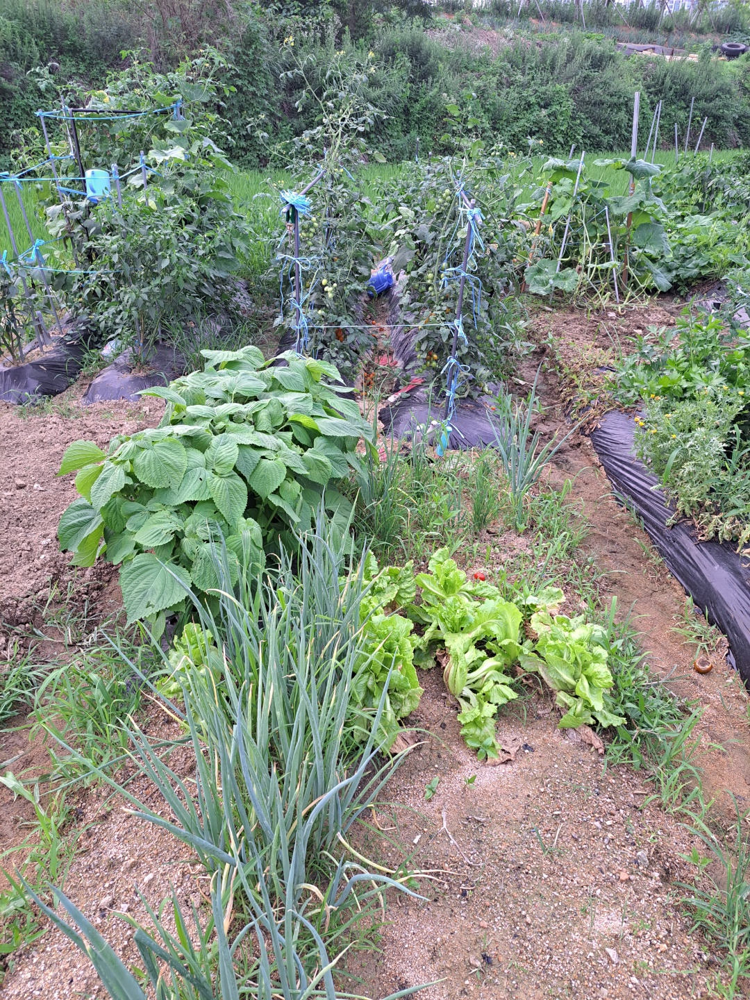
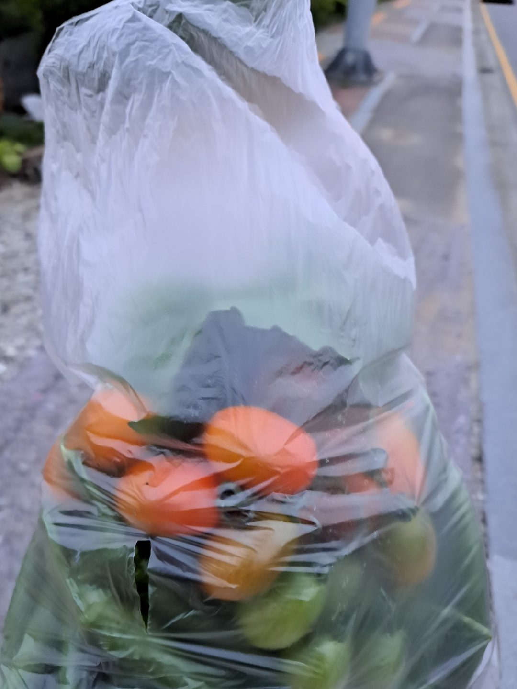
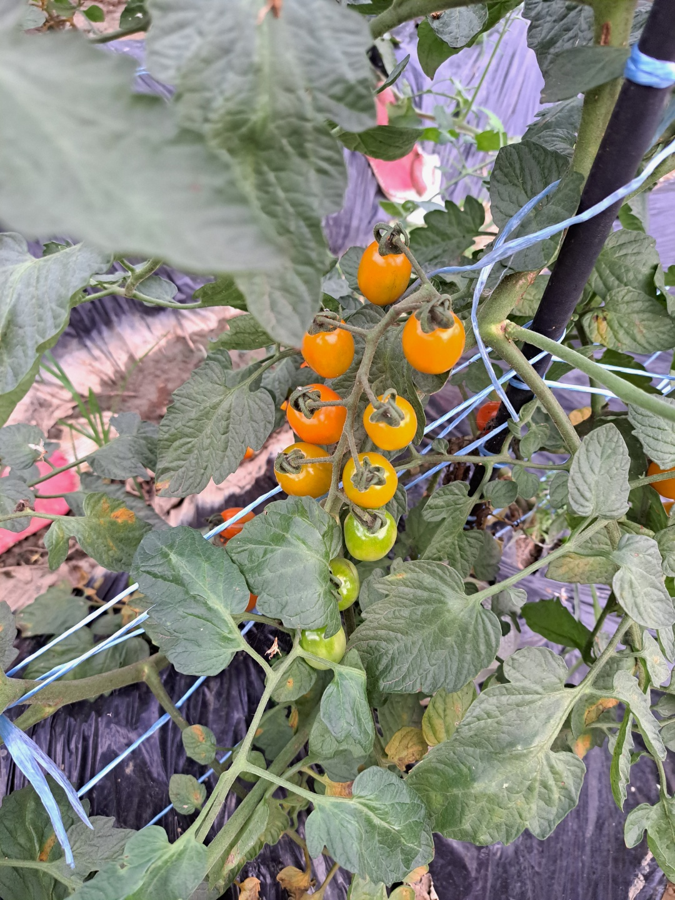
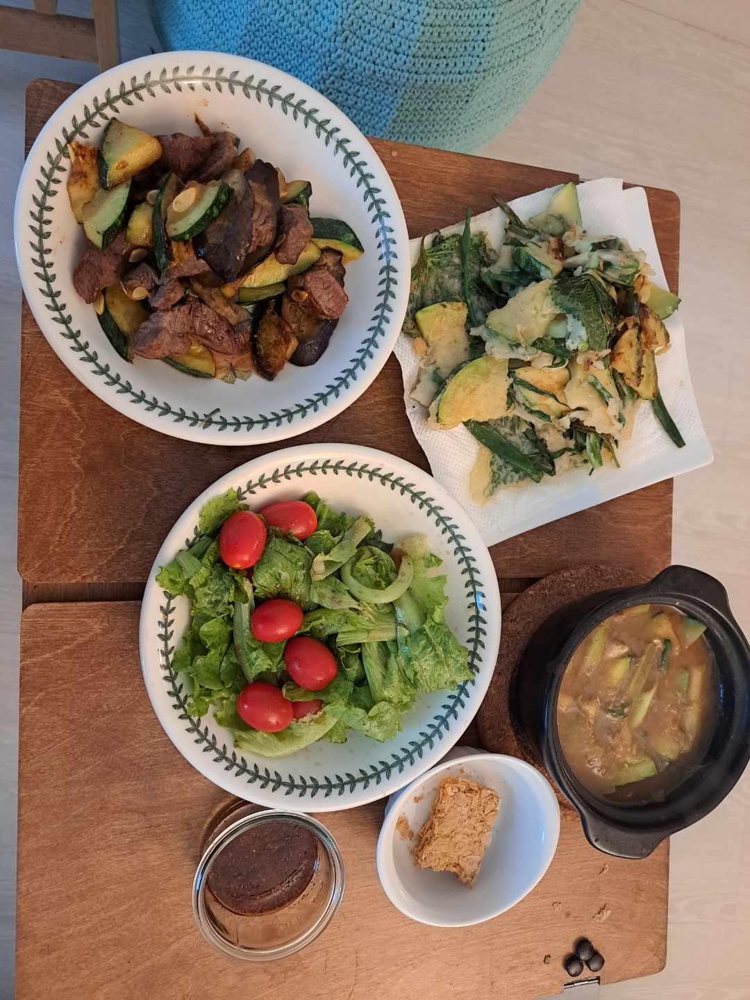
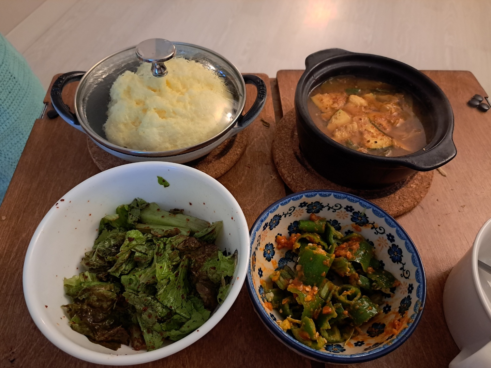

주말농장이라 주말에 방문  

</b>

</b>  

장마철이라 성장도 무시무시하게 하고 있고, 잡초도 무시무시하게 자라나고 있다.   
초보 농부이기도 하지만 주변에서 농사 어렵다고 함부로 뛰어들지 말라고 했는데, 그 말이 정말 맞는듯 하다. 상추, 파를 제외하고는 죄다 벌레가 다 먹어버리고, 수확을 하더라도   
어떻게 해먹어야할지 이 많은 걸 뭘 해 먹어야할지 난감하다.  

</b> 
  

오늘도  방문한 김에 다 커서 나무에 달려있는 고추와 아주 무성하고 풍성한 벌레먹은 깻잎을 마지못해(?) 따왔다.  

언제까지 쌈싸먹을 수도 없고 이건 블로그 검색해서 장아찌를 담아볼까 한다. 

  

</b>
줄줄이 달린 주황색 방울 토마토 쳐다만 봐도 웃음 짓게 만든다.   

이 두 평 남짓한 땅에서 이렇게 큰 즐거움을 주고, 먹을 것도 주고 참 하길 잘했다고 생각이 든다.  

모든 일이 그러하듯 내년이면 내후년이면.. 그리고 세월이 쭉 쌓이다 보면 요령이 생기겠지.  

나중에는 300~400평 농지 구매하고 나만의 공간에서 키우면서 취미생활해보고 싶다.  
그러기 위해서는 돈도 좀 모아야할 것이고, 농사 짓는 기술도 좀 더 좋아야하겠지?  

주말농장에서 나온 산출물로 만든 료리를 남겨본다. 이것도 다 추억이 될 것이다.   
 

  
   
</b>
근데 진짜 다르다 마트에서 사는 상추와 품종은 동일할지라도 확실히 밭에서 직접 따서 먹는거라서 그런지는 모르겠다 하지만 진짜 더 맛있다.

